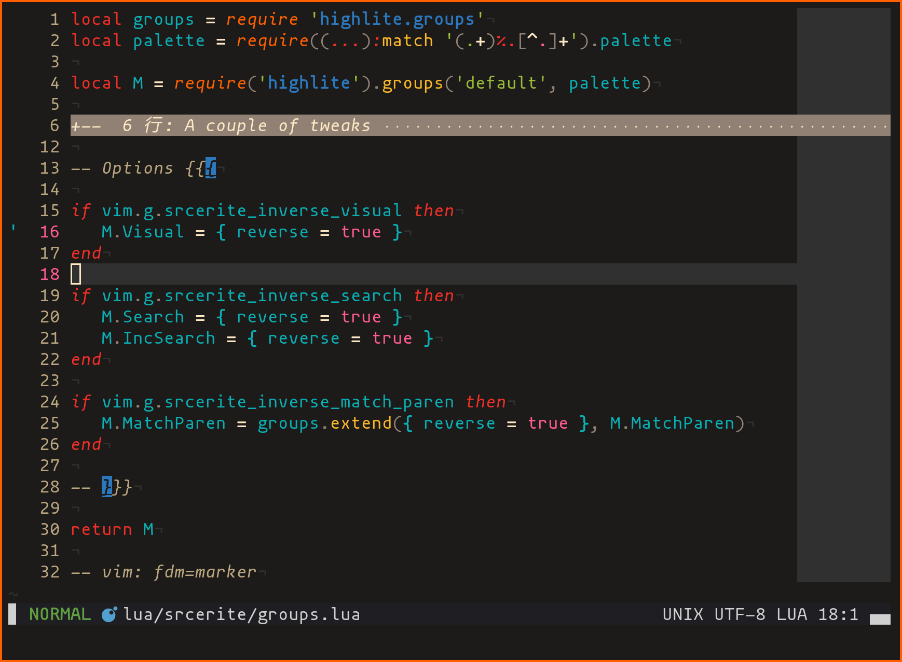

<!-- panvimdoc-ignore-start -->

# nvim-srcerite

Neovim colorscheme inspired by [Srcery][1].

[![check_badge]][check_status]
[![srcery_badge]][1]
[![highlite_badge]][2]

[check_badge]: https://img.shields.io/github/actions/workflow/status/m15a/nvim-srcerite/check.yml?logo=github&label=Check&style=flat-square
[check_status]: https://github.com/m15a/nvim-srcerite/actions/workflows/check.yml
[srcery_badge]: https://img.shields.io/badge/srcery-v1.0.4-ff5c8f.svg?style=flat-square
[highlite_badge]: https://img.shields.io/badge/highlite-v4-0aaeb3.svg?style=flat-square



<!-- panvimdoc-ignore-end -->

<!-- panvimdoc-include-comment

```vimdoc
Maintainer: NACAMURA Mitsuhiro <m15@m15a.dev>
URL: https://github.com/m15a/nvim-srcerite
License: BSD 3-Clause
```

-->

## Description

`srcerite` is a Neovim colorscheme made with [nvim-highlite][2], the
Neovim colorscheme generator. It is heavily inspired by [srcery-vim][3],
long time my favorite Vim colorscheme.

As its name implies, `srcerite` is a mix-in of `srcery` and `highlite`:
it is intended to make the best use of `srcery`'s contrasting color
palette and `highlite`'s semantic syntax highlighting.

## Installation

Use any package manager. It requires [nvim-highlite][2]. After
installation, append the following line to your `init.lua`.

```lua
vim.cmd.colorscheme 'srcerite'
```

## Configuration

You can customize this colorscheme using the following global variables.

### Options

| Option                                                        | Description                        | Type | Default |
| :-                                                            | :-                                 | :-   | :-      |
| [srcerite_inverse_visual](#srcerite_inverse_visual)           | Inverse color of visual selection. | bool | `true`  |
| [srcerite_inverse_search](#srcerite_inverse_search)           | Inverse color of search matches.   | bool | `false` |
| [srcerite_inverse_match_paren](#srcerite_inverse_match_paren) | Inverse color of matched parens.   | bool | `false` |

#### `srcerite_inverse_visual`

Replace foreground and background colors with each other (i.e. inverse
highlighting) in visual selection (default: `true`).

```lua
vim.g.srcerite_inverse_vidual = false
```

#### `srcerite_inverse_search`

Enable inverse highlighting of search matches (default: `false`).

```lua
vim.g.srcerite_inverse_search = true
```

#### `srcerite_inverse_match_paren`

Enable inverse highlighting of matched parentheses (default: `false`).

```lua
vim.g.srcerite_inverse_match_paren = true
```

## Contributing

If you like this colorscheme, don't forget to add star to
[nvim-highlite][2] and [srcery-vim][3]. Any contribution to this
project is also welcome.

<!-- panvimdoc-ignore-start -->

## License

[BSD 3-Clause](LICENSE)

<!-- panvimdoc-ignore-end -->

[1]: https://srcery.sh/
[2]: https://github.com/Iron-E/nvim-highlite
[3]: https://github.com/srcery-colors/srcery-vim

<!-- vim: set tw=72 spell nowrap: -->
